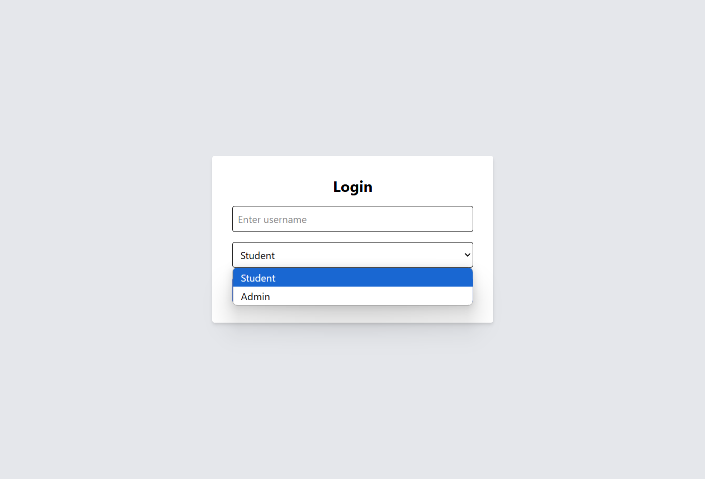
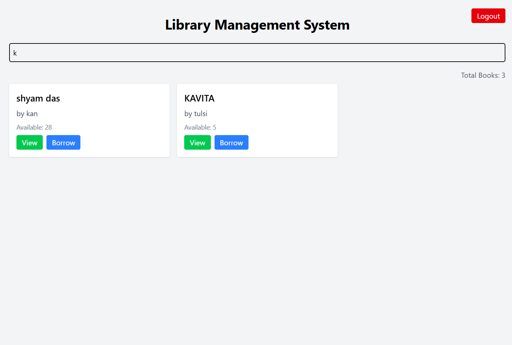
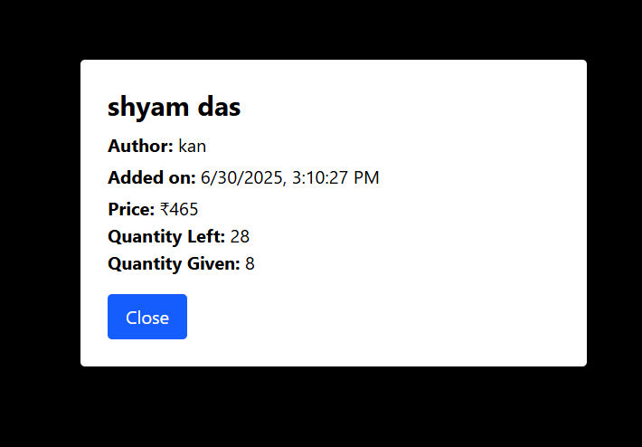
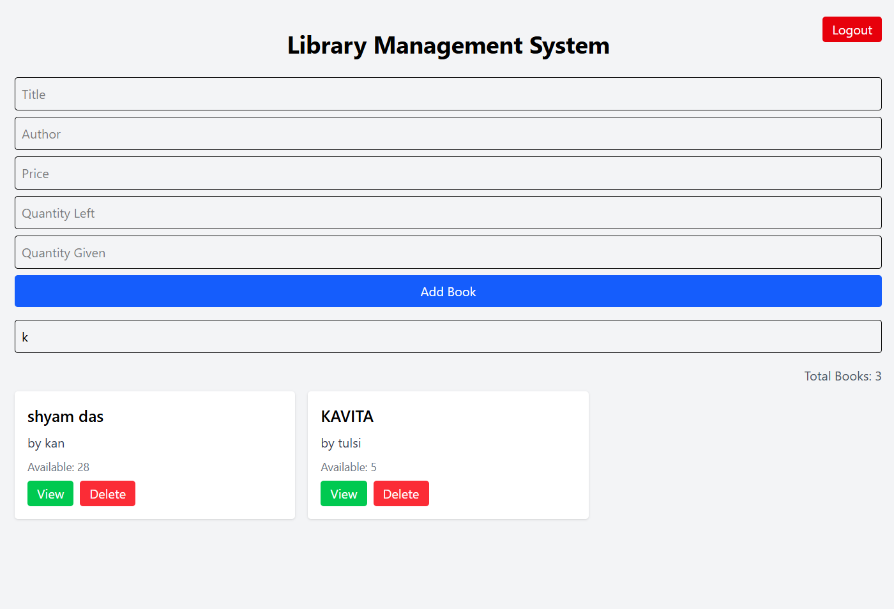
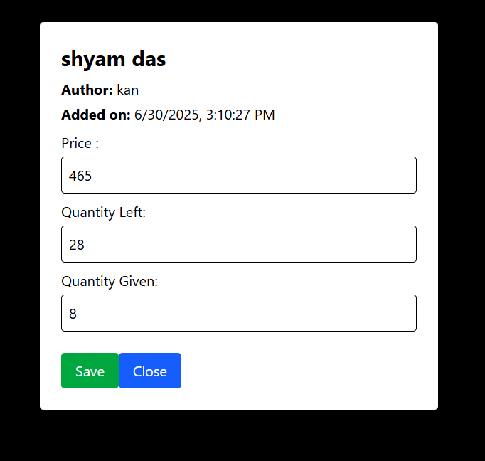

# Library Management System

A simple and modern **React.js** web application for managing books, built using **Vite**, **Tailwind CSS**, and **localStorage**. It includes features to add, search, delete, and filter books.

---

##  Features

-  Add new books
-  Search and filter books
-  Delete books
-  Data persists using localStorage
-  Fast build with Vite
-  Responsive UI using Tailwind CSS

---
### Screenshots

----

##  Tech Stack

- **React.js** (with Hooks)
- **Vite** (Build Tool)
- **Tailwind CSS** (Styling)
- **localStorage** (Persistence)
- **GitHub Pages** (Deployment)

---

##  Project Structure

Library-Management-System/
├── public/
│ └── favicon.svg
├── src/
│ ├── components/
│ │ ├── AddBookForm.jsx
│ │ ├── BookList.jsx
│ │ └── SearchBar.jsx
│ ├── App.jsx
│ ├── main.jsx
│ └── index.css
├── .gitignore
├── index.html
├── package.json
├── vite.config.js
└── README.md

# React + Vite

This template provides a minimal setup to get React working in Vite with HMR and some ESLint rules.

Currently, two official plugins are available:

- [@vitejs/plugin-react](https://github.com/vitejs/vite-plugin-react/blob/main/packages/plugin-react) uses [Babel](https://babeljs.io/) for Fast Refresh
- [@vitejs/plugin-react-swc](https://github.com/vitejs/vite-plugin-react/blob/main/packages/plugin-react-swc) uses [SWC](https://swc.rs/) for Fast Refresh

## Expanding the ESLint configuration

If you are developing a production application, we recommend using TypeScript with type-aware lint rules enabled. Check out the [TS template](https://github.com/vitejs/vite/tree/main/packages/create-vite/template-react-ts) for information on how to integrate TypeScript and [`typescript-eslint`](https://typescript-eslint.io) in your project.
